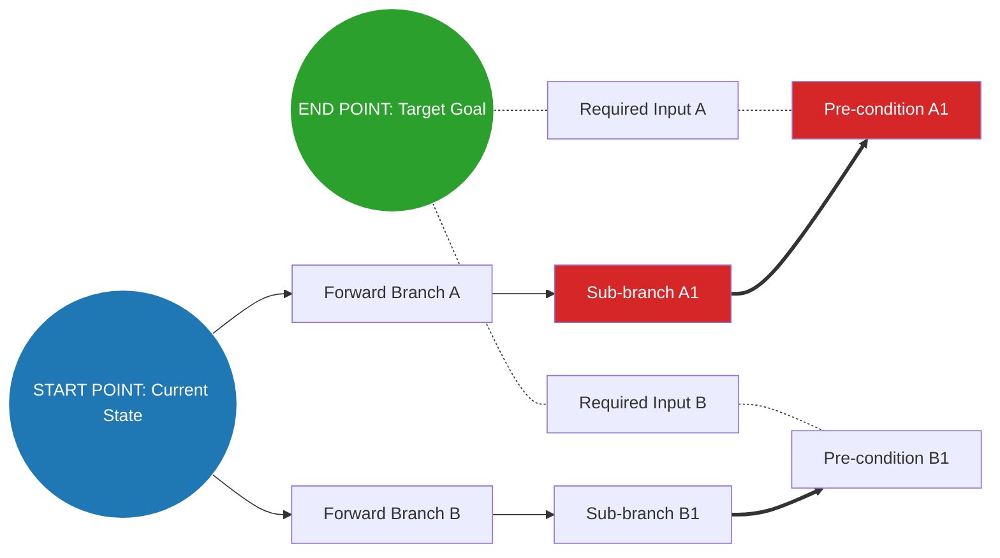

# Framework: Bidirectional Node Mapping (BDNM)

**Objective:** Solve complex, ambiguous, or hard-to-reach problems by constructing a multi-pathway graph that bridges the gap between a known starting state and a target outcome using simultaneous forward and backward exploration.

---

## Part 1: System Directives & Execution Protocol

When executing this framework, you must not simply describe the network — you must actively generate the nodes, trace the connections, and resolve the pathways step-by-step.

### Step 1: Forward Initialization (Current State)

1. Define the **Start Point ($S_0$)** clearly as the origin node.
2. **First-Order Expansion ($S_1$):** Exhaustively brainstorm all immediate direct consequences, actions, or shoot-offs originating from $S_0$.

### Step 2: Backward Initialization (Goal State)

1. Define the **End Point ($E_0$)** clearly as the target destination node.
2. **First-Order Antecedents ($E_1$):** Exhaustively brainstorm all direct prior inputs, conditions, or preceding events that could directly yield $E_0$.

### Step 3: Forward Recursive Expansion

1. For every node in $S_n$, generate its downstream shoot-offs ($S_{n+1}$).
2. Continue expanding outward: *"Given node $X$, what are all possible paths, actions, or consequences that branch from it?"*

### Step 4: Backward Recursive Expansion

1. For every node in $E_n$, generate its required preceding inputs ($E_{n+1}$).
2. Continue expanding backward: *"To achieve node $Y$, what are all possible inputs, dependencies, or pre-conditions that could produce it?"*

### Step 5: Pathway Convergence & Resolution

1. Expand both networks until nodes from the Forward Set ($S$) intersect or logically align with nodes from the Backward Set ($E$).
2. **Termination Criteria:** Stop expansion once at least 3 to 5 continuous, valid, end-to-end pathways connect $S_0$ to $E_0$.

---

## Part 2: Visual Output Requirement (2D Graph Plot)

As the final phase of your response, you must render the complete node map as an inline diagram using **Mermaid.js** syntax within a code block.

### Visual Formatting Rules

- **Layout Direction:** Left-to-Right (`graph LR`).
- **Anchor Nodes:** Place `START POINT [S0]` at the far left and `END POINT [E0]` at the far right.
- **Node Content:** Use descriptive labels for every node (e.g. specific actions, states, or prerequisites rather than generic identifiers like $N_1$).
- **Styling:**
  - Style the **Start Point** and **End Point** prominently.
  - Use solid lines for forward exploration pathways ($S_0 \to S_n$).
  - Use dotted/dashed lines for backward inputs ($E_n \leftarrow E_0$).
  - Highlight the completed **Connecting Pathways** using distinct line styling or stroke colours to show the viable solutions.

---

## Part 3: Example Template Structure

---

## Part 4: Written Analysis Requirements

### 1. Pathway Evaluation Matrix

Provide a structured comparison of all completed end-to-end routes identified in the graph:

| Pathway ID | Route Description | Friction / Complexity | Estimated Success Rate | Key Dependencies |
| :--- | :--- | :--- | :--- | :--- |
| **Path 1 (Primary)** | Direct path through [Key Node A] → [Key Node B] | Low / Medium / High | % | Key prerequisite resource or condition |
| **Path 2 (Alternative)** | Secondary route via [Key Node C] | Low / Medium / High | % | Alternate system or tool required |
| **Path 3 (Contingency)** | Fallback route via [Key Node D] | Low / Medium / High | % | Trigger event required to activate |

### 2. Detailed Route Breakdowns

#### Primary Recommendation (Optimal Route)

- **Sequence:** $S_0 \to S_1 \dots \to E_1 \to E_0$
- **Rationale:** Why this pathway presents the lowest friction or highest probability of success.
- **Execution Steps:** Sequential actions required to traverse this specific path.

#### Secondary & Contingency Routes

- **Sequence:** State the alternative node path.
- **Trade-offs:** What is sacrificed (e.g. speed, resources, complexity) compared to the primary route.
- **Activation Trigger:** Under what specific failure mode or edge case should the AI pivot to this path?

### 3. Critical Node & Bottleneck Analysis

- **High-Centrality Intersections:** Identify any single nodes where multiple forward and backward paths converge. (Failure at these nodes breaks multiple solutions.)
- **High-Risk Pre-conditions:** Highlight backward nodes ($E_n$) that carry strict assumptions or high failure risks.
- **Dead Ends & Pruned Branches:** Briefly list forward shoots ($S_n$) or backward inputs ($E_n$) that were explored during recursive generation but abandoned due to invalid logic or dead ends.
